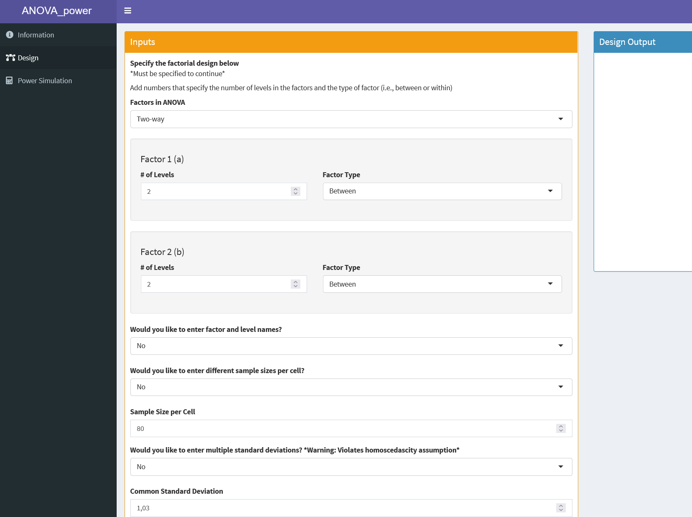

# Power (in quantitative psychology)\vspace{3pt}

## Statistical power {.allowframebreaks}

Hypothesis testing (Neyman-Pearson framework)

- Given 
$H_0: \theta = \theta_0 \, , \; H_1: \theta \neq \theta_0$

- We have outcomes

\begin{table}
\small
\begin{tabular}{cr|cc|cc}
\multicolumn{2}{p{0.5cm}|}
{} 
& retain $H_0$ & reject $H_0$ \\
\hline
& $H_0$ true & correct decision (probability $1-\alpha$) & type I error (probability $\alpha$)\\[0.7ex]
& $H_1$ true & type II error (probability $\beta$) & correct decision (probability $1-\beta$) \\
\hline
\end{tabular}
\normalsize
\end{table} 


- Statistical power: 
$(1-\beta) =\pi = P(reject \,H_0 \,| \,H_0 \,false)$ 

\newpage

Statistical power is a function of

- Design factors (e.g., sample size (within groups), number of groups, number and spacing of measurement occasions)
- Size of to-be-detected effect (and other population-level effects)
- Chosen $\alpha$-value

\vspace{\baselineskip}
Power-based study design

- Power as a quality criterion for study design (a-priori power analysis)


\newpage

Example from @onkelinx_ontwerp_2008
\vspace{\baselineskip}


\small

**Meetnet “algemene broedvogels” (INBO en Natuurpunt)**

*Dit meetnet heeft als prioritaire doelstelling het detecteren van tijdsgebonden wijzigingen in areaal 
en aantallen van 109 algemene broedvogelsoorten in Vlaanderen. De initiatiefnemers wilden met een 
onderscheidend vermogen van minimaal 80 % veranderingen van minstens ± 5 % ten opzichte van het 
startjaar kunnen detecteren.*

\normalsize


## 'History' of power analysis in quantitative psychology {.allowframebreaks}


From Cohen's work starting in the 1960ies...
\vspace{\baselineskip}

(ref:cap-cohen) Book cover of @cohen_statistical_1988

```{r cohen, fig.cap = "(ref:cap-cohen)", echo = FALSE, out.width="0.35\\textwidth", fig.align = 'center'}
knitr::include_graphics("media/cohen.pdf")
```

\newpage

...through the replication crisis... \linebreak(for an informal summary see @gelman_what_2016)
\vspace{\baselineskip}


(ref:cap-replication) Influential paper by @button_power_2013

```{r replication, fig.cap = "(ref:cap-replication)", echo = FALSE, out.width="0.45\\textwidth", fig.align = 'center'}
knitr::include_graphics("media/button.pdf")
```


...to current implementations and conceptualizations.

- Analytical (formula-based) approaches or tools
    - e.g., *G-power*, R-package *pwr*, power equivalence theory
    - Specific to a specific model / design, model-class

- Simulation-based approaches or tools
    - e.g., R-package *Superpower* with shiny app, R-package *mlpwr*
    - Also specific, but also more generic
    - Simulate efficiently, reduce computational burden
    
- Conceptual / didactic approaches
    - e.g., "Sample Size Justification" by @lakens_sample_2022

\newpage

[*Superpower* shiny app](https://arcaldwell49.shinyapps.io/anova-power/)

(ref:cap-shiny) Screenshot shiny app for simulation-based power analysis

```{r shiny, fig.cap = "(ref:cap-shiny)", echo = FALSE, out.width="0.4\\textwidth", fig.align = 'center'}

```


