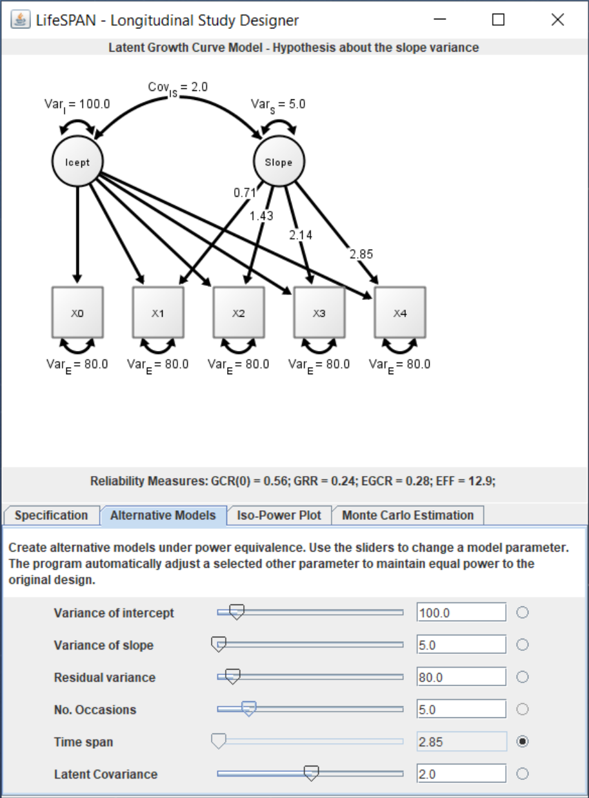

## Power equivalence theory in structural equation modeling {.allowframebreaks}

[@brandmaier_lifespan_2015; @von_oertzen_optimal_2013; @von_oertzen_power_2010]
\vspace{\baselineskip}

Aim

- Support power-analysis for linear structural equation models (SEMs) and according designs

Scope

- Find power equivalent designs or models (with desired power)
- Trade design and model parameters for each other to 'optimize' costs

Approach 

- Algorithm to reduce a given SEM (and design) to a ‘minimal power equivalent representative’
- If possible derive formula linking power to design / model parameters
- Otherwise simulation-based power analysis for minimal model (computationally lighter)
- Software *LIFESPAN*


\newpage

Linear structural equation models

- Measurement model: Regression of observed variables in $\pmb{y}_i$ on latent variables in $\pmb{\eta}_i$
$$\pmb{y}_i= \pmb{\tau} + \pmb{\Lambda\,\eta}_i + \pmb{\varepsilon}_i$$
- Structural model: Regression relationships among latent variables (acyclical)
$$\pmb{\eta}_i= \pmb{\alpha} + \pmb{B\,\eta}_i + \pmb{\zeta}_i$$
- Model estimation via maximum likelihood
\begin{align*}
\pmb{y}_i \sim MVN(\pmb{\mu},\pmb{\Sigma}) \quad&\text{with} \quad\pmb{\mu} = \pmb{\tau} +  \pmb{\Lambda}(\pmb{I-B})^{-1} \pmb{\alpha}
\\ &\text{and} \quad\pmb{\Sigma} = \pmb{\Lambda}(\pmb{I-B})^{-1}\pmb{\Psi}(\pmb{I-B})^{-1t}\pmb{\Lambda}^t +  \pmb{\Theta}
\end{align*}

\newpage


Linear structural equation models

- Flexible multivariate modeling framework
- Other models / frameworks as special cases, e.g.,\linebreak2-level linear mixed models [@curran_have_2003]


\newpage


:::::::::::::: {.columns .onlytextwidth}
::: {.column width="60%"}

(ref:cap-poweq1) Path diagram of a linear latent growth curve model

```{r poweq1, fig.cap = "(ref:cap-poweq1)", echo = FALSE, out.width="0.75\\textwidth", fig.align = 'center'}
knitr::include_graphics("media/LGCM.pdf")
```


:::
::: {.column width="40%"}


$$
\begin{bmatrix}
Y_{t=1}\\
Y_{t=2}\\
Y_{t=3}\\
\vdots \\
Y_{t=6}
\end{bmatrix}_{i}
= 
\begin{bmatrix}
1\\
1\\
1\\
\vdots \\
1
\end{bmatrix}I_i 
+ 
\begin{bmatrix}
0\\
1\\
2\\
\vdots \\
5
\end{bmatrix}S_i
+ 
\begin{bmatrix}
\varepsilon_{t=1}\\
\varepsilon_{t=2}\\
\varepsilon_{t=3}\\
\vdots \\
\varepsilon_{t=6}\\
\end{bmatrix}_i
$$

:::
::::::::::::::


\newpage

Linear latent growth curve model and ‘minimal power equivalent representative’

- Focus: Statistical power to detect non-zero slope variance

(ref:cap-poweq2) from @von_oertzen_optimal_2013

```{r poweq2, fig.cap = "(ref:cap-poweq2)", echo = FALSE, out.width="0.35\\textwidth", fig.align = 'center'}
knitr::include_graphics("media/vonoertzen13_fig1.pdf")
```


\newpage

Trade-off between number of measurement occasions and study length

- Statistical power to detect non-zero slope variance remains constant

(ref:cap-poweq3) from @von_oertzen_optimal_2013

```{r poweq3, fig.cap = "(ref:cap-poweq3)", echo = FALSE, out.width="0.3\\textwidth", fig.align = 'center'}
knitr::include_graphics("media/vonoertzen13_fig2.pdf")
```


\newpage

[*LIFESPAN*](https://www.brandmaier.de/lifespan/) software [@brandmaier_lifespan_2015]

(ref:cap-poweq4) Screenshot of the Longitudinal Interactive Front‐End Study Design Planner

```{r poweq4, fig.cap = "(ref:cap-poweq4)", echo = FALSE, out.width="0.2\\textwidth", fig.align = 'center'}

```


